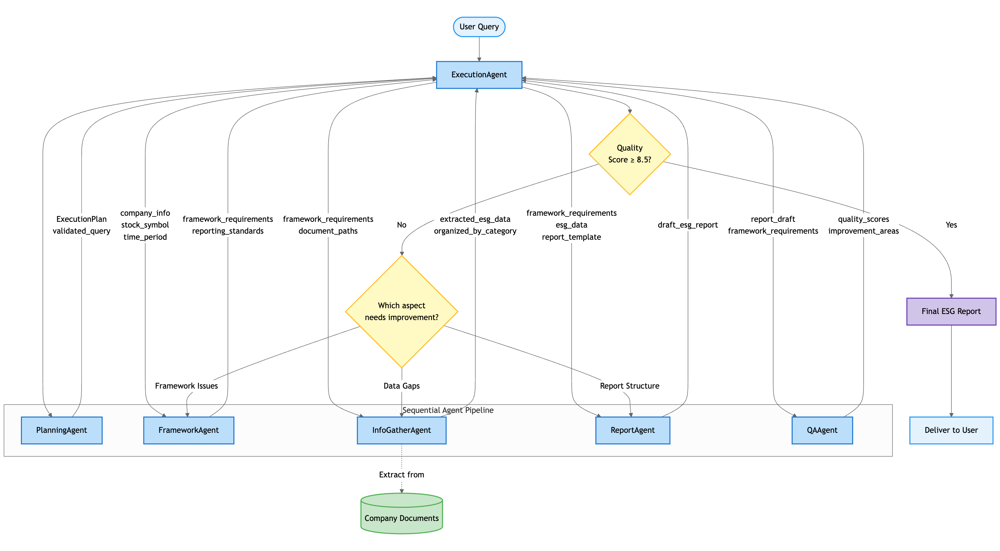

# Agent Design Documentation

## Agent Architecture Overview

The ESG Reporting system uses a specialized multi-agent approach where each agent has distinct responsibilities and expertise. This approach enables:

1. Modularity and separation of concerns
2. Specialized prompting for each task
3. Improved maintainability and extensibility
4. Iterative refinement through agent collaboration

## Agent Workflow

## Agent Specifications

### ExecutionAgent

**Purpose**: Orchestrate the ESG reporting pipeline and manage agent interactions

**Key Responsibilities**:

-   Coordinate the execution flow between specialized agents
-   Manage error handling and recovery
-   Implement iterative refinement based on QA feedback
-   Track quality metrics and determine when to finalize reports
-   Monitor timeouts and processing constraints

**Design Considerations**:

-   Uses a state machine pattern to track progress
-   Implements robust error handling with fallbacks
-   Maintains context throughout the reporting pipeline
-   Uses adaptive refinement based on QA scores

### PlanningAgent

**Purpose**: Analyze user queries and create structured plans for report generation

**Key Responsibilities**:

-   Validate input parameters (company, stock symbol, reporting period)
-   Determine required reporting frameworks
-   Create structured plan for report generation
-   Set constraints and guidelines for other agents

**Prompt Engineering**: Focused on understanding user intent, structuring plans, and identifying key requirements

### FrameworkAgent

**Purpose**: Identify and apply relevant ESG reporting frameworks

**Key Responsibilities**:

-   Determine applicable frameworks (IFRS S1, IFRS S2, HKEX ESG Code)
-   Extract framework-specific requirements
-   Create structure guidance based on regulatory standards
-   Ensure compliance with reporting best practices

**Prompt Engineering**: Specialized knowledge of ESG reporting standards, regulatory requirements, and framework application

### InfoGatherAgent

**Purpose**: Extract relevant ESG information from company documents

**Key Responsibilities**:

-   Process PDF documents and extract ESG-related information
-   Organize extracted data according to framework requirements
-   Validate information quality and relevance
-   Map information to reporting categories

**Prompt Engineering**: Focused on information extraction, categorization, and relevance assessment

### ReportAgent

**Purpose**: Generate comprehensive ESG reports based on gathered information

**Key Responsibilities**:

-   Structure ESG report according to framework requirements
-   Ensure narrative coherence and completeness
-   Format output for readability and professional presentation
-   Address gaps and inconsistencies in gathered information

**Prompt Engineering**: Specialized in report writing, structure, and professional communication

### QAAgent

**Purpose**: Evaluate report quality and identify areas for improvement

**Key Responsibilities**:

-   Assess report quality against framework requirements
-   Identify content gaps and structural issues
-   Provide actionable feedback for refinement
-   Assign quality scores for decision-making

**Prompt Engineering**: Focused on evaluation criteria, quality assessment, and identifying improvement opportunities

## Agent Communication

Agents communicate through structured data objects that pass through the ExecutionAgent, which maintains context and ensures proper information flow. Each agent receives inputs from previous stages and produces outputs for subsequent stages.

## Iterative Refinement Process

The system implements an iterative refinement process:

1. Initial report generation based on gathered information
2. QA evaluation to identify quality issues
3. Targeted refinement by specific agents based on identified issues
4. Re-evaluation until quality thresholds are met or maximum iterations reached

## Prompt Engineering Principles

Each agent uses specialized prompts designed for its specific task:

1. **Task-specific context**: Each prompt includes relevant background for the specific task
2. **Clear instructions**: Explicit guidance on expected outputs and formats
3. **Few-shot examples**: Where appropriate, examples of desired outputs
4. **Guardrails**: Constraints to prevent hallucinations and ensure accuracy
5. **Structured outputs**: Clear formatting requirements for consistent processing
